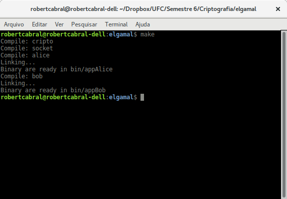
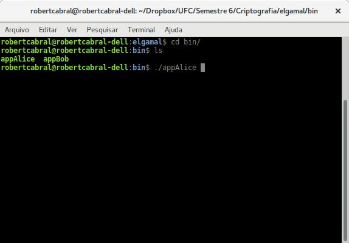

# Como usar

## Compilação

Para a compilação é necessário somente o programa gcc. Em seguida deve-se compilar usando o comando **"make MODE=AUTO/MANUAL"**, no Makefile existem duas instancias, o de Alice e Bob. Caso a compilação seja para um dos dois especificos use **"make MODE=AUTO/MANUAL alice"** ou **"make MODE=AUTO/MANUAL bob"**. Caso queira compilar os para os dois, o padrão **"make MODE=AUTO/MANUAL"** fará isso. Escolha se deseja usar o modo manual ou automatico usando **"make MODE=AUTO"**, para automatico e **"make MODE=MANUAL"** para o modo manual.

## Rodando o código

Para a executar o código basta acessar a pasta **"bin/"** que lá estará os arquivos executaveis de Alice e Bob. Para que tudo ocorra como esperado, deve-se iniciar primeiro o executavel de Alice e então inicia o executavel de Bob, pois Alice funciona com um servidor UDP que fica bloqueado esperando Bob se comunicar.

